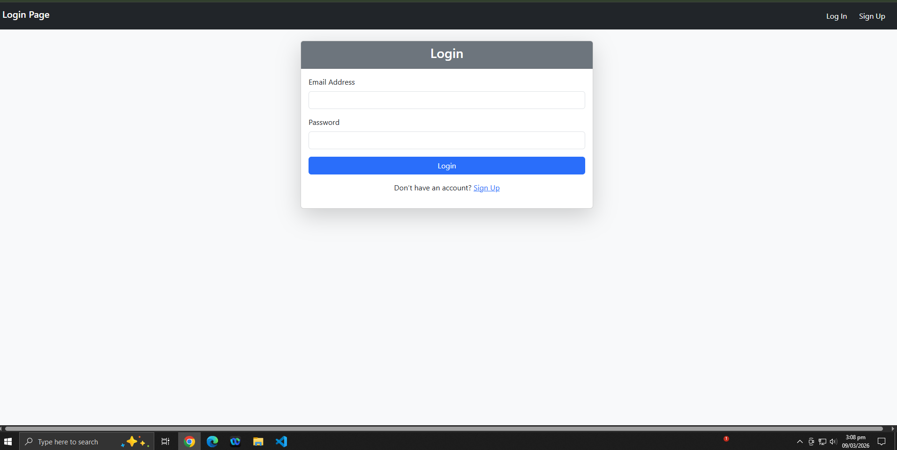
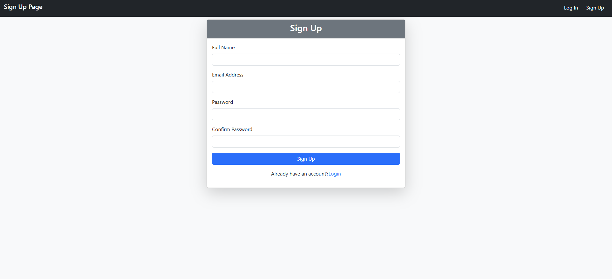
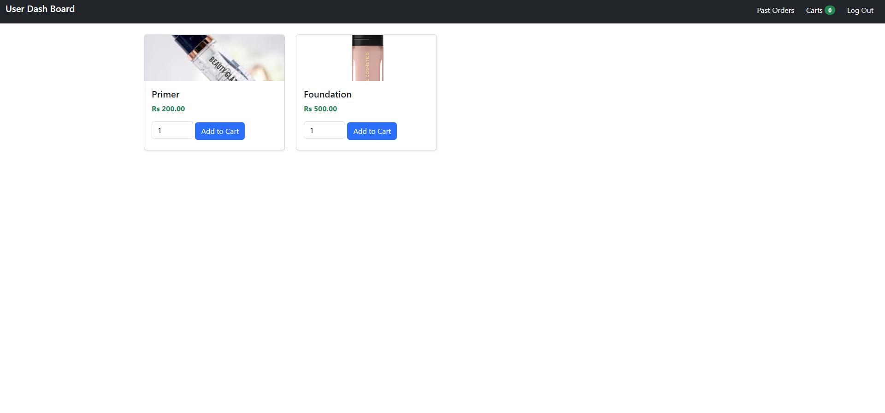
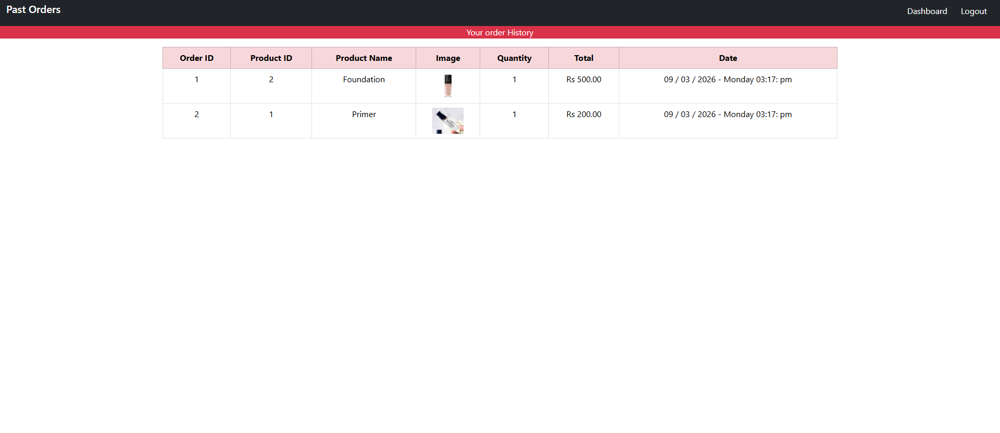
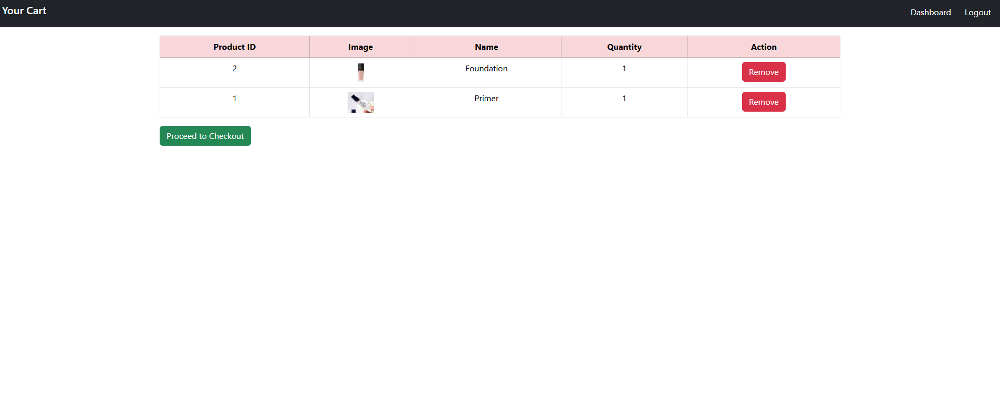
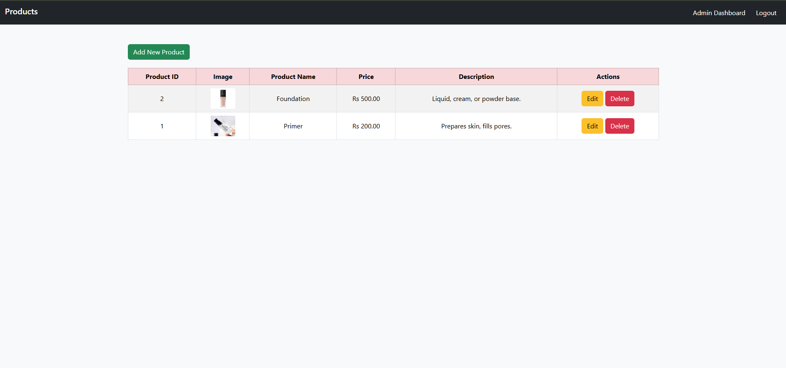
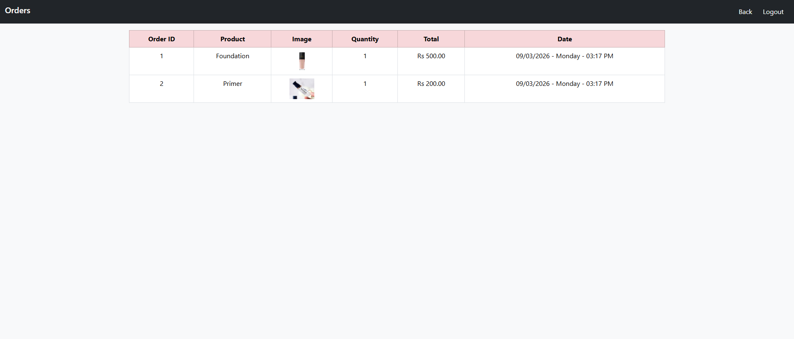

# E-Commerce System

A simple **E-Commerce Web Application** where users can browse products, add them to cart, and purchase items, while the administrator can manage products and monitor user orders.

This project demonstrates **authentication, product management, shopping cart functionality, and order tracking** in a web-based environment.

---

# Objective

The objective of this project is to build a basic **online shopping system** that allows:

- Users to **register, log in, browse products, and purchase items**
- Administrators to **manage products and monitor user purchases**

---

# User Roles

## Admin

Admin has full control over the system and can:

- Log in using admin credentials
- Add new products
- Update existing products
- Delete products
- View all registered users
- Monitor purchase history

---

## User

Users can interact with the system by:

- Creating a new account
- Logging in using credentials
- Browsing available products
- Adding products to cart
- Purchasing products
- Viewing their order history

---

# Features

## Authentication

Signup Page

- Name
- Email
- Password
- Confirm Password

Features:

- Email uniqueness validation
- Password security
- Session-based login system

Login Page

- User authentication
- Redirect users to their respective dashboard after login

---

## Product Management (Admin)

Admin can:

- Add new products
- Update product information
- Delete products
- Upload product images
- Manage product categories

Product fields:

- Product Name
- Price
- Image
- Category
- Description

---

## Product Browsing (User)

Users can:

- View product list
- See product image, name, and price
- Add products to cart
- View cart items

---

## Shopping Cart

Users can:

- Add products to cart
- Remove products from cart
- View total cart price

---

## Order Management

Users can:

- Checkout and purchase items
- View previous orders
- Track order history

Admin can:

- View all orders
- Monitor customer purchases

---

# Database Structure

## Users Table

id
name
email
password
role

---

## Products Table

id
name
price
image
description

---

## Orders Table

id
user_id
product_ids
total_amount
date

---

# Technologies Used

Frontend

- HTML
- CSS
- Bootstrap
- JavaScript
- jQuery

Backend

- PHP

Database

- MySQL

---

# Default Login Credentials

## Admin Login

Email
[admin@gmail.com](mailto:admin@gmail.com)

Password
12345678

---

## Employee Login

Email
[employee@gmail.com](mailto:employee@gmail.com)

Password
12345678

---

# Screenshots

### Login Page

### Signup Page

### Product Listing

### Order History User Side

### Shopping Cart

### Admin Product Management

### Order History Admin Side

---

# Project Structure

ecommerce-system

admin
user
assets
includes
screenshots
README.md

---

# Author

Hassan Zohaib Jadoon
Junior Web Developer

GitHub
https://github.com/HassanZohaibJadooni
